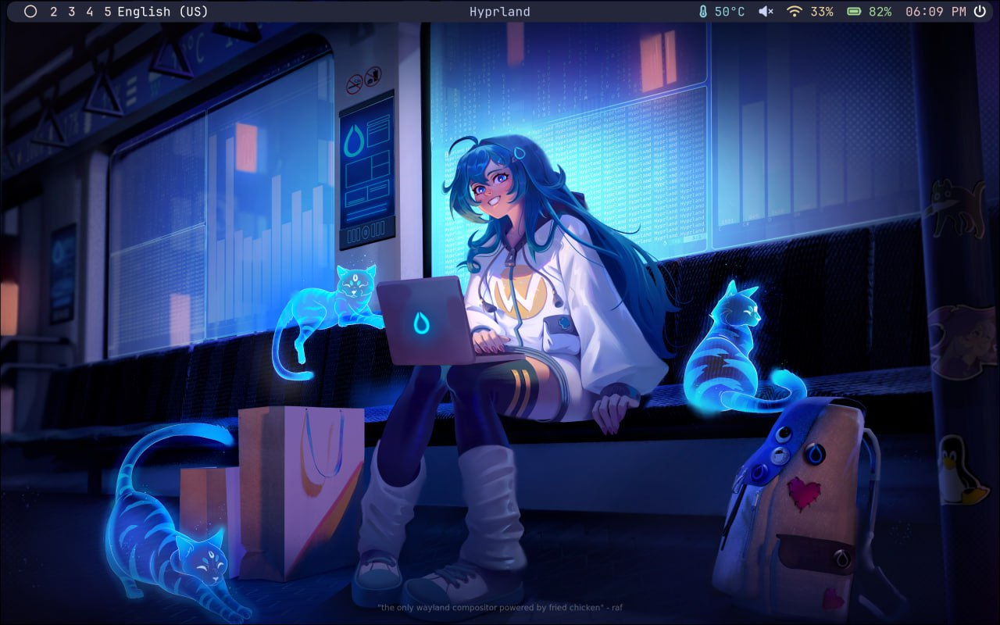
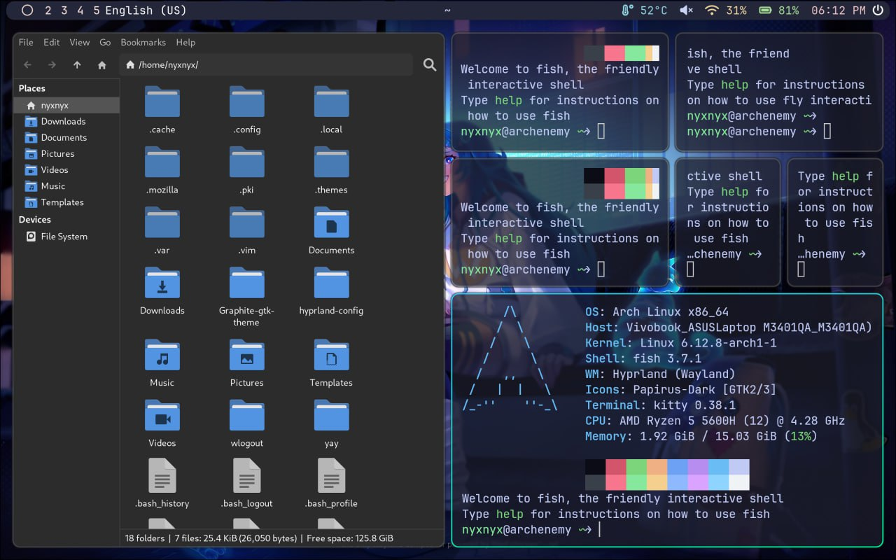
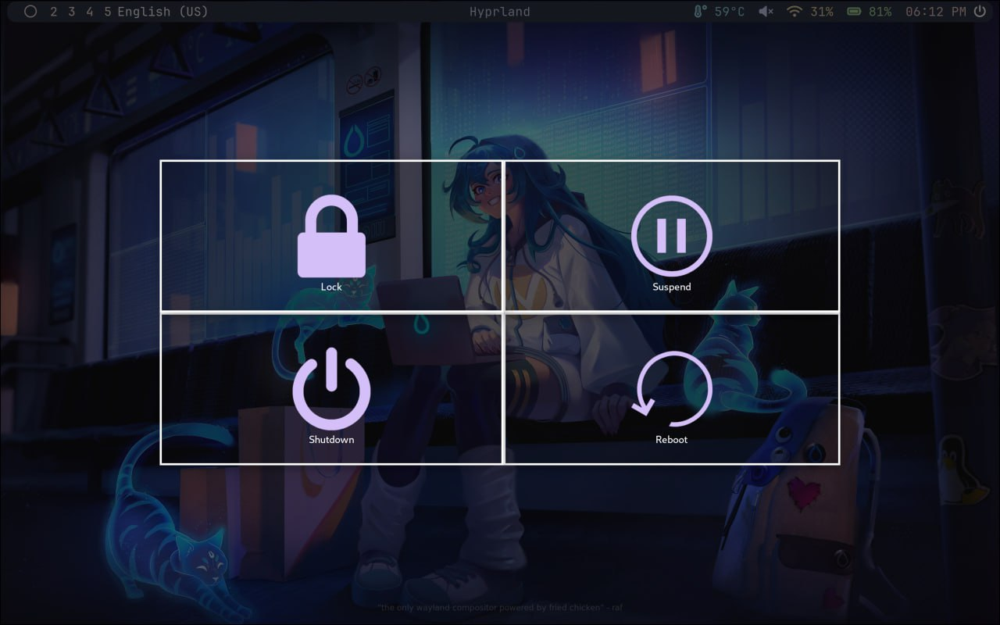
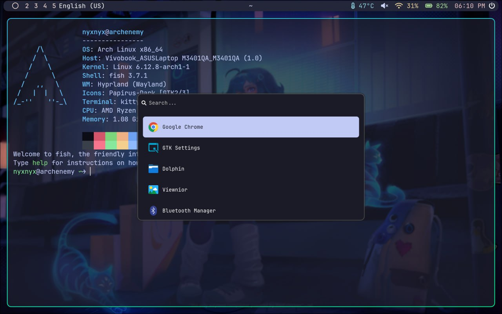

<!-- INFORMATION -->
<h1 align="left">About</h1> 


</br>

 - OS: **`Arch Linux`**
 - WM: **`Hyprland`**
 - Bar: **`Waybar`**
 - Terminal: **`Kitty`**
 - App Launcher: **`Wofi`**
 - Shell: **`Fish`**
 - Logout menu: **`Wlogout`**

</br>


<!-- IMAGES -->
## Gallery






<!-- HOTKEYS -->
## HotKeys
* **Open the terminal** - `super + enter`
* **Close active window** - `super + q`
* **Open file manager** - `super + e`
* **Open the application menu** - `super + r`
* **Open firefox** - `super + f`
* **Open google** - `super + g`
* **Lock the screen** - `super + l`
* **Take a screenshot** - `print`
* **Restart bspwm** - `ctrl + shift + r`
* **Switch to another workspace** - `super + [0-9]`
* **Move focus within workspace** - `super + [←, ↑, →, ↓]`
* **Move window within workspace** - `super + shift + [←, ↑, →, ↓]`
* **Start obsidian** - `super + c`
* **Start virtualbox** - `super + v`

The other hotkeys are in `~/.config/hypr/hyprland.conf`.

<!-- INSTALLATION -->
## Installation

```
git clone https://github.com/buzzismaloy/dotfiles-hyprland.git

mv fastfetch/* ~/.config/fastfetch/
mv hypr/* ~/.config/hypr/
mv kitty/* ~/.config/kitty/
mv waybar/* ~/.config/waybar/
mv wlogout/* ~/.config/wlogout/
mv wofi/* ~/.config/wofi/
```

To show fetch every time kitty is started:

```
cp fish/config.fish ~/.config/fish/config.fish
```
