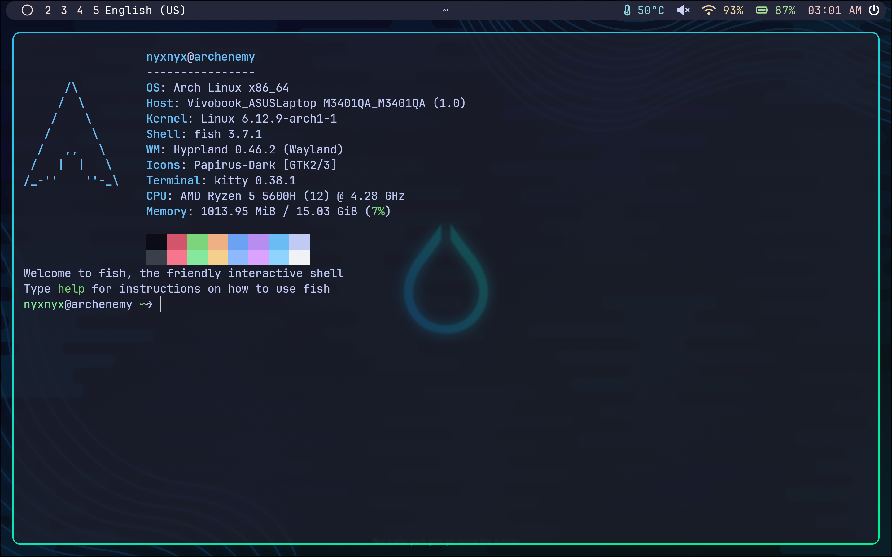

<!-- INFORMATION -->
<h1 align="left">About</h1> 

 

 - OS: **`Arch Linux`**
 - WM: **`Hyprland`**
 - Bar: **`Waybar`**
 - Terminal: **`Kitty`**
 - App Launcher: **`Wofi`**
 - Shell: **`Fish`**

 

<!-- IMAGES -->
## Gallery

<!-- HOTKEYS -->
## HotKeys
* **Open the terminal** - `super + enter`
* **Close active window** - `super + q`
* **Open file manager** - `super + e`
* **Open the application menu** - `super + r`
* **Open firefox** - `super + f`
* **Open google** - `super + g`
* **Lock the screen** - `super + l`
* **Take a screenshot** - `print`
* **Restart bspwm** - `ctrl + shift + r`
* **Switch to another workspace** - `super + [0-9]`

The other hotkeys are in `~/.config/hypr/hyprland.conf`.
